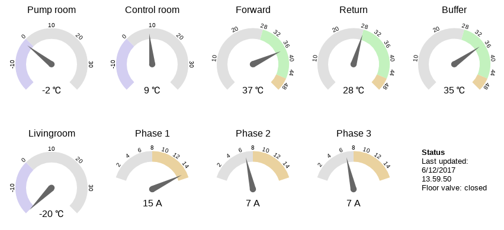

= Vert.x serial port logger

This is an example on how to use Vert.x to read data from a serial input/USB port and then push the data onto the event bus.

I use it to collect data from an microcontroller which monitors temperatures and power usage related to a heat pump. The setup is illustrated below:

The microcontroller (Arduino) is connected to a single board computer (Raspberry Pi) via USB.
The microcontroller outputs a collection of readings to the seriel port every 10 seconds.

The primary task of service running on the Pi is to take that data and publish it on the Vert.x EventBus.

Another service running on a different server then consumes the pubslished messages and stores measurements in a database.

== Verticles
The first part is the *SerialVerticle*. This verticle reads the data from the serial port and converts it into a JSON representation which it then publishes on the event bus.

The main consumer of the data messages on the event bus is the *LoggerVerticle*.
It takes the JSON message with the measurement data and stores it in a RDBMS.

__For legacy reason data is stored in a RDBMS - it works in my setup but may not scale as well as more dedicated storage solutions. In any case, the beauty of the loosely coupled verticles is that it would be trivial to replace the *LoggerVerticle* with another consumer.__

The *PanelVerticle* is also a consumer of the measurements. The verticle shows the real time data from the sensors in a web browser.
With deceiving simplicity the verticle uses the web extension to set up a web server with a couple of routes,
and establishes a bridge for the event bus so messages can be consumed by the client in the web browser (via WebSockets).

__The verticle does not show historical data, this is handled by a different (legacy) application not included here.__

The *MqttVerticle* is used to handle some extra sensors run by a number of ESP8266 boards. In order to provide integration with my *openHAB* setup the ESP8266 boards talk to a MQTT broker (*Mosquitto* which is as a part of the openHAB setup).
The verticle subscribes to the relevant topics and republish the data on the Vert.x event bus so the data can be consumed by the other verticles.

__The Mosquitto broker was the latest addition to the setup, but it only required changes to the *MqttVerticle* - the change was transparent to the rest of the verticles because the messages on event bus did not change.__

The final verticle is the *ReplayVerticle* which is included for testing/demo purposes.
It can be configured to replay data from the database or from a text file (one is included in the project).

Actually, there is one more verticle. The build product is a fat jar where the manifest names the *MainVerticle* as the main verticle.
This verticle reads the configuration and starts the verticles "enabled" in the configuration (those where the instance count is greater than zero).

== Miscellaneous

The data is generated by an Arduino controller, the C++ file (.ino) is included in the project,
but of course, any controller using serial output could be used as data source.

For the actual use case, the controller is hooked up to a Raspberry B+
(i.e. a single core 32 bit ARM processor with 512MB RAM).

Despite the limited compute power, the latest Raspian Jessie and the incl. Java 8 JDK works fine with Vert.x - putting "micro" back into micro service :-)

There is a systemd unit file in the *conf* directory which shows the options. Given the limited RAM setting JVM memory options is required.

Enabling clustering adds considerable to the start up time on a Raspberry so the Vert.x alert time (i.e. verticles blocking the event loop) should be be increased as indicated in the unit file.

In my current setup the Pi starts the *SerialVerticle* and the *PanelVerticle*.
The *LoggerVerticle* and *MqttVerticle* runs on a different server (talking to the database).

== Prerequisites

* Java JDK 8+
* Vert.x 3.5.x (3.4.x won't work due to changes to the MQTT extension)

== Building the project

The project consists of a number of verticles which is built into a single fat jar.
Of course the verticles could be build into separate jars, but for my purpose it easier just to have one jar.
I then use the configuration to determine what verticles runs where - the distributed event bus makes this is easy.

__There are a few Groovy scripts as well, useful for prototyping, but they are not part of the build.
While the vertx command line can run Java files directly, as usual the syntactic sugar in Groovy just makes it easier to use for that purpose (assuming that you are familiar with Groovy of course :-)__

To build the project, just use:

----
./gradlew shadowJar
----

It generates a _fat-jar_ in the `build/libs` directory.

Please check the JavaDoc comments in the various verticles to see how to configure them.

Also check the JavaDoc and the systemd Unit file to see options for running the service.

To run the demo, build the project as described and run the following command (assuming you are placed in the root directory of the project and the version is 1.8):

----
java -jar build/libs/vertx-serial-port-logger-1.8-fat.jar -conf src/conf/demo-config.json
----

This will start the ReplayVerticle, the LoggerVerticle and the PanelVerticle.
You should start seeing the output from the LoggerVerticle appear every second (replaying at 10x speed).

__Once all the test data has been processed a message will be printed, the service will continue to run though so you must kill it explicitly.__

Point you browser to http://localhost:9000 to see the output from the PanelVerticle.
The web client will connect to the server and then wait for the data to arrive on the event bus.

__Note that the data does not include measurements from all the sensors, hence some of dials show no reading.__

__The test data is from a cold night so heat pump runs a couple of times during the two hours covered by the data.
When the phase 1 current spikes it is because the heat pump turns on the built in eletrical heater - at which point it becomes an expensive way of heating the radiators but luckily this rarely happens...__

